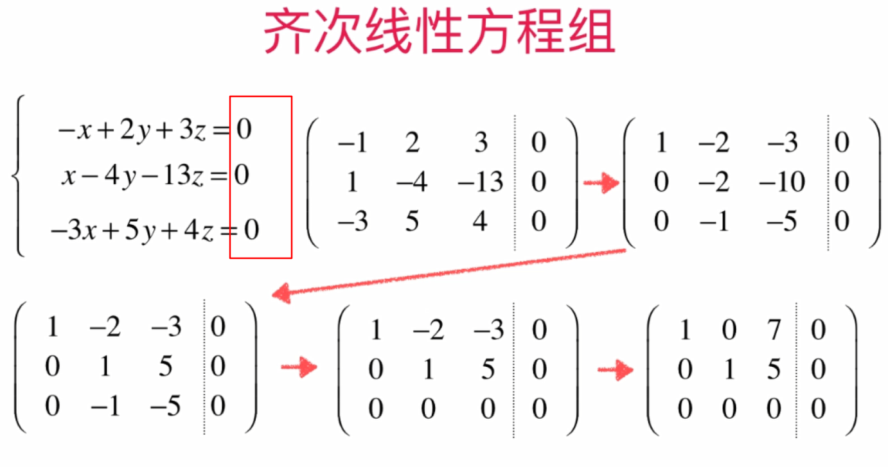
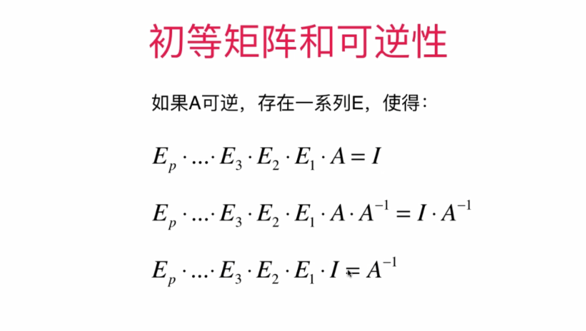
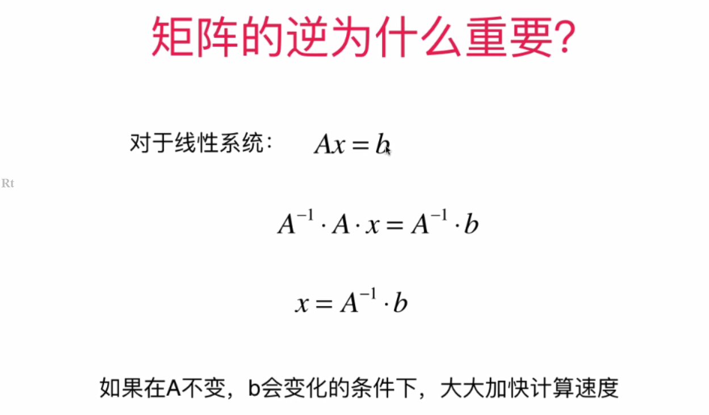
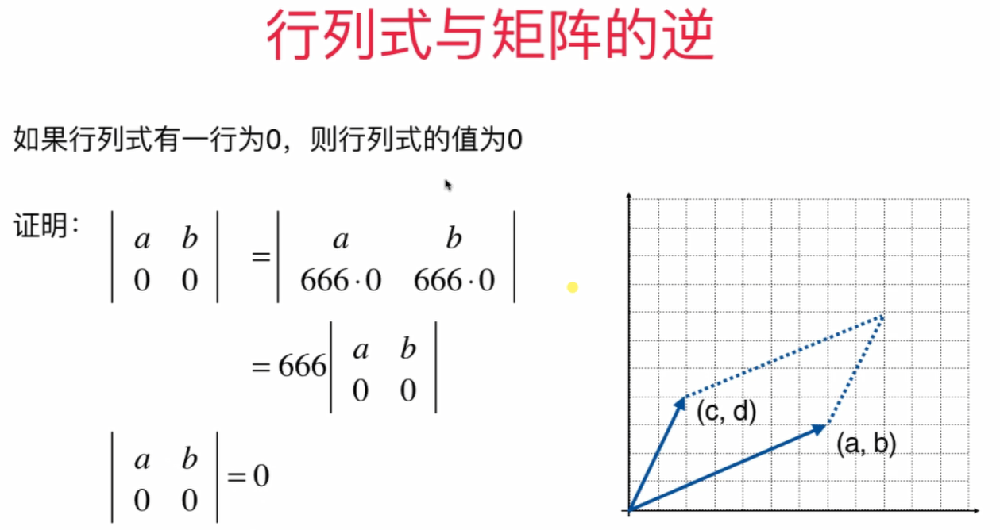
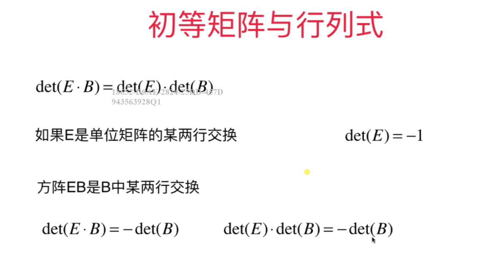
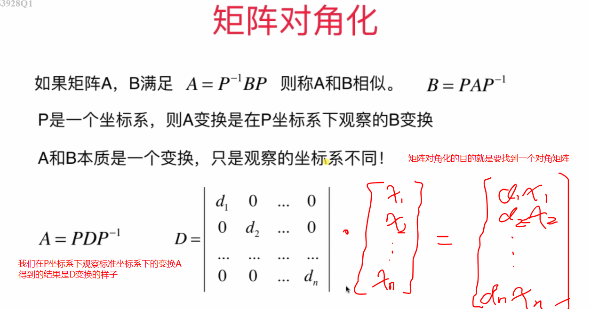

线性代数

## 1.向量


### 1.1 向量的加法和乘法


### 1.2 零向量的由来


==反证法和数学归纳法是计算机中较为常用的证明方法==


### 1.2 向量的模


### 1.3 单位向量


### 1.4 向量的点乘(内积)


## 2.矩阵

### 2.1 矩阵数量乘法

三个点：(0,0),(4,0),(5,3)


### 2.2 矩阵表示方程


### 2.3 矩阵和向量的乘法

==矩阵和向量的乘法，可以把矩阵理解为向量的函数，把一个向量转换成了另一个向量==


### 2.4 矩阵在图形变换中的应用


### 2.4 更多变换矩阵


### 2.5 逆矩阵


==A: 2 * 3==

==B:3 * 2==

==C:3 * 2==

==AC = I==

==AC:2 * 2==

==I: 2 * 2== 

==所以可以B(AC)、BI==

```
A:( 2 * 3 ):
    1 2 3
    4 5 6
B( 3 * 2)
BA = I( 3 * 3)
B:
	a b						-4/3 2/3    						
	c d						2/3  -1/3
	e f						1/3   0    代入之后发现不成立，是无解的(方程个数大于未知数个数的叫做超定方程组，超定方程组一般是无解的，但是也有可能有唯一解或无穷组解，例如某些方程系数成比例可以通过初等变化消掉)
	
a + 4b = 1      2a + 8b = 2
2a + 5b = 0		3b = 2  	b = 2 / 3
3a + 6b = 0		a + 2b = 0  a = -4 / 3

c + 4d = 0   2c + 8d = 0   
2c + 5d = 1	3d = -1    		d = -1 / 3
3c + 6d = 0 c + 2d = 0 		c = 2 / 3

e + 4f = 0     2e + 8f = 0
2e + 5f = 0		3f = 0 		f = 0
3e + 6f = 1     3e = 1		e = 1 / 3
```

==可逆矩阵一定是方阵，因为可逆矩阵的定义为AB=BA=I，非方阵一定不可逆==

==对于矩阵A，如果它存在逆矩阵B，那么B是唯一的==


==式中的矩阵都是方阵==

### 2.6 看待矩阵的不同视角


## 3.线性系统与消元法

### 3.1 高斯消元法


### 3.2 高斯-约旦消元法


### 3.2 线性方程组解的结构


#### 3.2.1 行最简形式


==行最简形式：==

==（1）非零行的第一个元素(主元)为1==

==（2）主元所在的列其他的元素均为0==


==这里的A代表系数矩阵的非零行==


==对于行最简形式，系数矩阵的非零行不可能大于未知数个数(列数)(每次行只能+1，列则可能走多个)，做正方形可轻易想出==


#### 3.2.2 找出主元，方便求解


#### 3.2.2 齐次线性方程组




## 4.线性系统与矩阵的逆

### 4.1 求解矩阵的逆


### 4.2 初等矩阵


#### 4.2.1 思考过程：


第一行 * k


第三行+第一行


第一行-第三行


第二行-p倍第三行


交换矩阵的第二行和第三行


#### 4.2.2 初等矩阵和可逆性

==初等矩阵是在单位矩阵上稍作变换得到的==


==初等矩阵都是可逆的==




==从这个式子中可得到与上面求一个方阵的逆矩阵一样的结果，即要求A的逆，只需要对单位矩阵做一系列将A变成单位矩阵的初等变换==

#### 4.2.3 矩阵的逆为什么这么重要





==rref(A)指的是A的行最简形式==


==对于上述几个等价命题的逆否命题也是正确的==

### 4.3 矩阵的LU分解(Lu分解主要是针对方阵)-----这一章有待进一步理解


[上三角矩阵](https://baike.baidu.com/item/%E4%B8%8A%E4%B8%89%E8%A7%92%E7%9F%A9%E9%98%B5/3557163?fr=aladdin)：主对角线以下都是零的方阵称为上三角矩阵。上三角矩阵和下三角矩阵都是方阵

可进行LU分解的矩阵要满足的条件之一是==矩阵是可逆的==

==在不进行精确阐述的情况下：高斯消元法的过程，通过初等变化，把一个矩阵变成了上三角矩阵是正确的==


==解释为什么一系列初等矩阵的逆乘起来恰好是单位下三角矩阵L==


==使用LU分解后计算性能更高==


#### 4.3.1 矩阵的LDU分解


#### 4.3.2 矩阵的PLUP分解


==再看矩阵的乘法==


==矩阵的LU分解待理解，但貌似不太重要，先放这==

## 5.线性组合

### 5.1 我们已接触过的线性组合


==矩阵和向量的乘法可以看做是矩阵的列向量的一个线性组合==


### 5.2 线性相关


==线性相关意味着其中一个向量可以写成其他向量的线性组合==


### 5.3 线性无关


==线性无关意味着任何一个向量都不可以表示成其他向量的线性组合，线性无关的向量组合意味着这组向量是互相独立的==


### 5.4 线性相关的重要性质


#### 5.4.1 如何判断是否线性相关


==若向量中存在零向量，则这组向量线性相关==

### 5.5 直观理解线性相关和线性无关


### 5.6 生成空间


### 5.7 空间的基


#### 5.7.1 空间的基的性质


## 6. 空间、向量空间、欧几里得空间

### 6.1 空间


### 6.2 向量空间


==向量空间对加法和数量乘法封闭==


==向量不是随便定义的==

例子：对于整数空间，对于加法是封闭的，两个整数相加还是整数，对于除法则不是封闭的

### 6.3 广义向量空间


#### 6.3.1 广义向量空间的例子


### 6.4 子空间


==理解：整个三维空间是所有点的集合，子空间是部分点的集合==

### 6.5 维度


==如果一组向量v1,v2,...,vp可以生成n维空间，那么P>=n，如果p>n，那么这组向量是线性相关的，删除线性相关的向量，仍可生成n维空间，循环往复，得到最少个数的向量便得到这个n维空间的一组基,而这个空间的维数就是基的个数==


### 6.6 行空间


==非零行的个数即为生成空间的维度(证明待解决)==


==执行高斯-约旦消元法后，行最简形式中的非零行即是这个生成空间的一组基(证明待解决)==

### 6.7 列空间

、


### 6.8 矩阵的秩


==方阵满秩意味着化为行最简形式非零行的个数和主元列的个数为n，意味着行最简形式为单位矩阵,意味着行空间和列空间生成的空间的维度都是n，意味着列向量组是线性无关的，意味着行向量组也是线性无关的==


### 6.9 零空间


==A的行空间可由A的一系列行向量线性组合形成,可证明零空间中的向量和A的行空间中所有向量点乘结果为0==

==两个向量点乘结果为0,意味着这两个向量垂直(v1.v2=|v1|*|v2|*cos(theta))==

#### 6.9.1 零空间的基


#### 6.9.2 秩-零化度定理


#### 6.9.3 行空间、列空间、零空间、左零空间


### 6.10 研究子空间的意义


## 7. 正交基与标准正交基

### 7.1 正交向量组


==任意两个向量都是正交的(即两个向量点乘结果为0),则称为正交向量组==

==正交非零向量一定线性无关==


### 7.2 正交基和标准正交基


==n个非零正交向量一定是n维空间的基==


### 7.3 通过任意一组基构造正交基的过程

#### 7.3.1 投影


#### 7.3.2 格拉姆-施密特过程


==格拉姆-施密特过程主要用于在子空间中求正交基,如果不是在子空间中完全可以使用(e1,e2,e3,...)==

### 7.4 标准正交矩阵


### 7.5 矩阵的QR分解


==只考虑A是方阵==


==矩阵的QR分解是基于格拉姆-施密特过程的，因此要保证A的各个列向量线性无关==


==真正实现的时候使用下面这个公式==


## 8. 空间的基和坐标系

### 8.1 空间的基和坐标系


 


### 8.2 坐标系转换

#### 8.2.1 其他坐标系转化为标准坐标系


#### 8.2.2 标准坐标系转换为其他坐标系


#### 8.2.3 任意两个坐标系之间的转换


==互为逆矩阵==


由上图同理


==考虑标准坐标系可推理得到其他坐标系：==

==标准坐标系转换为其他坐标系时,所给出的基为标准坐标系下的b1,b2,...,bn,得到的转换矩阵为PB,直接PB[Xb]便得到结果==


证明：


### 8.3 线性变换


## 9.行列式

### 9.1 行列式的意义


==我们只在方阵中研究行列式==

==行列式是一个数，行列式在二维空间表示有向面积，高维空间表示有向体积==


### 9.2 行列式的基本性质





### 9.3 行列式与矩阵的逆


### 9.4 行列式值的计算


由此得：


### 9.5 初等矩阵与行列式


==A.B之后得到的新矩阵也是线性相关的==





==由此可看到，如果方阵A可逆时，det(A) != 0==

### 9.6 行列式中行式即列式


### 9.7 行列式的代数表达形式


## 10. 特征值和特征向量

[马同学讲特征值和特征向量](https://www.zhihu.com/question/21874816)

### 10.1 特征值和特征向量的概念


==我们只在讨论方阵时研究特征值和特征向量，特征值和特征向量是成对出现的==


==变换后得到的向量和原来的向量在一条直线上==


### 10.2 特征值和特征向量的求解


==对应一个λ的特征向量并不唯一，有无数个==


==向量空间一定包含零向量==


==简单特征值：解为实数，切不重复==


==特征值和特征向量是成对出现的==


### 10.3 特征值和特征向量的性质


### 10.4 特征值和特征向量的直观理解


==矩阵是变换，某些向量做一个变换后，得到的向量还在原来的方向上==


### 10.5 “不简单”的特征值


==当λ是多重时，它所对应的特征空间不一定是一条直线==


### 10.6 矩阵相似性

[马同学讲矩阵相似性](https://zhuanlan.zhihu.com/p/31003468)


==类似相似三角形，我们可以说A和B是同一个变换，只是我们观察的视角不同罢了==


==这幅图的意思在说P坐标系下的A变换(比如翻转、投影等操作)就相当于在标准坐标系下的同样的B变换(当然也是翻转、投影等操作)==

==A,B是同一个变换，只不过是在不同坐标系下观察的。观察B是在标准坐标系下，观察A是在P坐标系下，记住变换==

==标准坐标系下的B变换和P坐标系下的A变换是等价的==


==标准坐标系下的一个变换B到了P坐标系下看和谁是一样的呢？是A==

==我们在P坐标系下观察标准坐标系下的B变换得到的结果是A变换的样子==


==相似点：两个三角形相似，角是相同的，同样的对于矩阵相似型==


==我们在表示A的时候通常会选择在标准坐标系下表示，因此P是B的基在标准坐标系下的表示==


==这里面的“我认为这个就是简单的坐标系”指的是B这个变换所在的坐标系==

==对角矩阵*(diagonal matrix)是一个主对角线之外的元素皆为0的矩阵==




## 14. 对称矩阵


==奇异值从大到小排==


==奇异值从大到小排==


