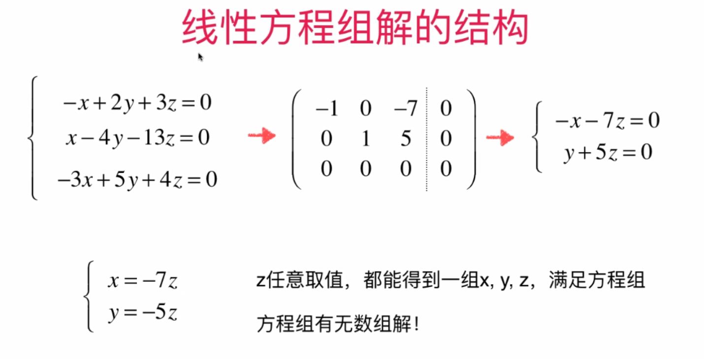
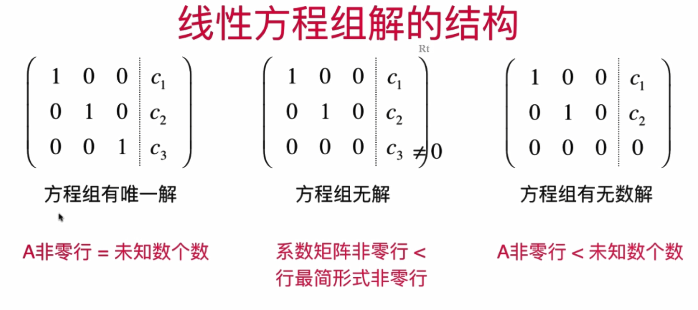

# 											线性代数

## 1.向量


### 1.1 向量的加法和乘法


### 1.2 零向量的由来


==反证法和数学归纳法是计算机中较为常用的证明方法==


### 1.2 向量的模


### 1.3 单位向量


### 1.4 向量的点乘(内积)


## 2.矩阵

### 2.1 矩阵数量乘法

三个点：(0,0),(4,0),(5,3)


### 2.2 矩阵表示方程


### 2.3 矩阵和向量的乘法

==矩阵和向量的乘法，可以把矩阵理解为向量的函数，把一个向量转换成了另一个向量==


### 2.4 矩阵在图形变换中的应用


### 2.4 更多变换矩阵


### 2.5 逆矩阵


==A: 2 * 3==

==B:3 * 2==

==C:3 * 2==

==AC = I==

==AC:2 * 2==

==I: 2 * 2== 

==所以可以B(AC)、BI==

```
A:( 2 * 3 ):
    1 2 3
    4 5 6
B( 3 * 2)
BA = I( 3 * 3)
B:
	a b						-4/3 2/3    						
	c d						2/3  -1/3
	e f						1/3   0    代入之后发现不成立，是无解的(方程个数大于未知数个数的叫做超定方程组，超定方程组一般是无解的，但是也有可能有唯一解或无穷组解，例如某些方程系数成比例可以通过初等变化消掉)
	
a + 4b = 1      2a + 8b = 2
2a + 5b = 0		3b = 2  	b = 2 / 3
3a + 6b = 0		a + 2b = 0  a = -4 / 3

c + 4d = 0   2c + 8d = 0   
2c + 5d = 1	3d = -1    		d = -1 / 3
3c + 6d = 0 c + 2d = 0 		c = 2 / 3

e + 4f = 0     2e + 8f = 0
2e + 5f = 0		3f = 0 		f = 0
3e + 6f = 1     3e = 1		e = 1 / 3
```

==可逆矩阵一定是方阵，因为可逆矩阵的定义为AB=BA=I，非方阵一定不可逆==

==对于矩阵A，如果它存在逆矩阵B，那么B是唯一的==


==式中的矩阵都是方阵==

### 2.6 看待矩阵的不同视角


## 3.线性系统与消元法

### 3.1 高斯消元法


### 3.2 高斯-约旦消元法


### 3.2 线性方程组解的结构





#### 3.2.1 行最简形式


==行最简形式：==

==（1）非零行的第一个元素(主元)为1==

==（2）主元所在的列其他的元素均为0==




==这里的A代表系数矩阵的非零行==


==对于行最简形式，系数矩阵的非零行不可能大于未知数个数(列数)(每次行只能+1，列则可能走多个)，做正方形可轻易想出==


#### 3.2.2 找出主元，方便求解


#### 3.2.2 齐次线性方程组


## 4.线性系统与矩阵的逆

### 4.1 求解矩阵的逆


### 初等矩阵


#### 思考过程：


#### 矩阵的LU分解


### 使用LU分解后计算性能更高


### 矩阵的LDU分解


### 矩阵的PLUP分解


#### 再看矩阵的乘法


#### ==矩阵的LU分解待理解，但貌似不太重要，先放这==

## 5.线性组合


#### 线性无关的向量组合意味着这组向量是互相独立的


### 线性相关的重要性质


#### 如何判断是否线性相关


### 生成空间


