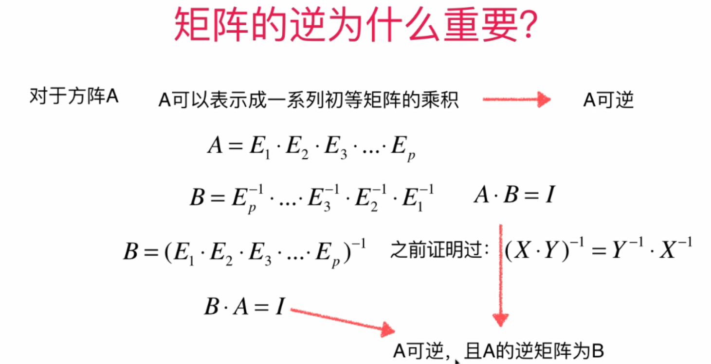

# 											线性代数

## 1.向量

### 零向量的由来

### 反证法和数学归纳法是计算机中较为常用的证明方法

### 向量的模

### 单位向量

### 向量的点乘(内积)

## 矩阵

### 更多变换矩阵

==A: 2 * 3==

==B:3 * 2==

==C:3 * 2==

==AC = I==

==AC:2 * 2==

==I: 2 * 2== 

==所以可以B(AC)、BI==

### 可逆矩阵一定是方阵，因为可逆矩阵的定义为AB=BA=I，非方阵一定不可逆

### 对于矩阵A，如果它存在逆矩阵B，那么B是唯一的

### 待确定：当AB都是方阵的前提下，上述结论

## 线性系统与消元法

## 线性系统与矩阵的逆

### 初等矩阵

#### 思考过程：

#### 矩阵的LU分解

